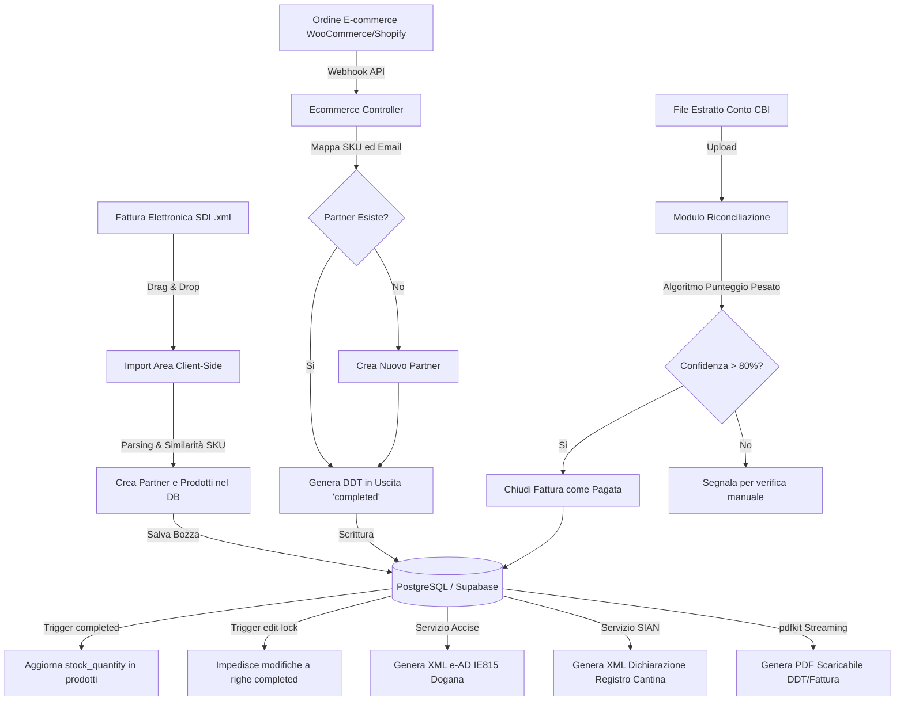

# 🍷 Cantina Privilege Selection - Analisi Tecnica, Architetturale e Valutazione Commerciale

Benvenuto nel documento ufficiale di presentazione e valutazione dell'asset software **Cantina Privilege Selection**. Questo documento è stato redatto per fornire a potenziali acquirenti, investitori o partner tecnologici una panoramica dettagliata delle specifiche tecniche, della qualità del codice, dei costi stimati di sviluppo, delle prospettive di business e del valore commerciale di questo ERP verticale per il settore vitivinicolo.

---

## 1. Presentazione del Progetto & Problem-Solving

**Cantina Privilege Selection** è un **ERP (Enterprise Resource Planning) leggero, moderno e altamente specializzato**, sviluppato su misura per le esigenze delle cantine vitivinicole, dei distributori di vino e dei commercianti di bevande alcoliche.

Il software risponde a una sfida fondamentale del mercato: **le piccole e medie cantine necessitano di strumenti agili ma conformi a normative fiscali ed operative complesse**, spesso ignorate dai gestionali generici a basso costo (es. Shopify, QuickBooks) e integrate solo in ERP legacy pesanti, costosi e obsoleti (es. SAP, Zucchetti, TeamSystem).

### Principali Problemi Risolti dal Software:
1. **Gestione del Magazzino Vitivinicolo**: Gestione nativa di **Annata** (vintage, es. "2018", "NV") e **Formato** (0.375L, 0.75L, Magnum 1.5L) per ciascun prodotto.
2. **Dinamismo dei Listini Prezzi**: Gestione di listini flessibili con ricarichi percentuali associati al profilo cliente (es. Listino HORECA +25%, Listino Privati +50%), combinabili con eccezioni a inserimento manuale.
3. **Automazione Fiscale (SDI XML)**: Un parser client-side drag-and-drop legge istantaneamente le fatture elettroniche XML italiane (.xml), importa o mappa automaticamente i fornitori, crea i prodotti mancanti ed elabora la fattura di acquisto in bozza, pronta per l'approvazione e il carico a magazzino.
4. **Riconciliazione Bancaria CBI**: Un motore di importazione dei file di estratto conto standard italiano CBI (Corporate Banking Interbancario) analizza le transazioni e le riconcilia automaticamente con le fatture emesse utilizzando un algoritmo di matching a punteggio pesato (importo, causale, anagrafica partner).
5. **Conformità SIAN & EMCS (Excise/Dogane)**: Moduli dedicati per la generazione dei file XML conformi alle specifiche ministeriali del **SIAN** (Sistema Informativo Agricolo Nazionale) e dell'**EMCS** (Excise Movement and Control System - tracciati e-AD per le accise doganali).
6. **Integrazione E-commerce (WooCommerce/Shopify)**: Endpoint Webhook integrati per scaricare automaticamente lo stock e generare DDT in uscita non appena un cliente acquista dallo store online.

---

## 2. Stack Tecnologico & Architettura

Il sistema è stato progettato con un'architettura **decoupled** (disaccoppiata) che garantisce massima modularità, facilità di manutenzione e scalabilità orizzontale.

### La Struttura dell'Applicazione:
*   **Backend (API Server)**: Sviluppato in **NestJS** e **TypeScript**. NestJS è il framework enterprise-grade per Node.js più robusto sul mercato, basato su pattern architetturali solidi (Iniezione delle Dipendenze, Controller, Service e Moduli).
*   **Frontend (Client SPA)**: Sviluppato in **React (v19)** con **Vite** e **TypeScript**. L'interfaccia utente è priva di framework CSS pesanti (come Tailwind o Bootstrap), utilizzando **Vanilla CSS** puro per ottimizzare al massimo le prestazioni di caricamento (Core Web Vitals) e mantenere il controllo totale sullo stile visuale.
*   **Database & Cloud Backend**: Basato su **Supabase / PostgreSQL**. Sfrutta PostgreSQL per garantire la massima integrità transazionale tramite vincoli di chiave esterna, indici mirati e procedure logiche memorizzate (triggers PL/pgSQL).

### 🛠️ Focus sulle Tecnologie Utilizzate:
| Componente | Tecnologia | Ruolo nel Progetto |
| :--- | :--- | :--- |
| **Backend Core** | NestJS (Node.js) & TypeScript | Gestione delle API, autenticazione, logica di calcolo provvigioni, abbinamenti CBI e webhook e-commerce. |
| **Generazione PDF** | `pdfkit` (Node.js) | Generazione in streaming a livello server di documenti fiscali (DDT, Fatture) in formato PDF pulito e personalizzato. |
| **Parser XML** | Native DOMParser (Frontend) | Parsing ultrarapido e sicuro client-side delle fatture elettroniche. |
| **Database** | PostgreSQL (Supabase) | Persistenza dati, trigger relazionali, colonne calcolate nativamente ed esecuzione di query complesse. |
| **Frontend SPA** | React 19 & Vite | Interfaccia reattiva a elevato impatto estetico. |
| **Validazione Dati** | `zod` & `class-validator` | Validazione end-to-end dello schema delle API e dei form (es. controllo formale P.IVA italiana e codici SDI). |
| **Icons & Assets** | `lucide-react` | Set di icone moderno e minimale. |

---

## 3. Qualità del Codice & Scelte Architetturali di Rilievo

Il codice sorgente mostra un livello di maturità da **Senior Developer**, con scelte architetturali mirate a garantire affidabilità ed estensibilità.

### A. Dual-Storage Layer (Supabase vs InMemory Mock)
Una delle caratteristiche più brillanti per la portabilità del codice è l'implementazione del pattern **Dual-Storage**. All'avvio del backend, il sistema controlla se le credenziali del database live Supabase sono configurate. 
*   **Se configurate**: le API interrogano direttamente PostgreSQL sul cloud.
*   **Se mancanti**: il sistema attiva automaticamente un **MockStore in memoria pre-seedato** con dati di test realistici (prodotti con sconti reali, transazioni CBI, partner storici). 
*   *Valore Commerciale*: Consente a sviluppatori, clienti o investitori di testare l'intera app a livello locale in 30 secondi con un semplice `npm run dev`, senza configurare database o server esterni.

### B. Logica Spostata nel Database (PostgreSQL Triggers & Generated Columns)
Per evitare disallineamenti di magazzino o discrepanze di calcolo, la business logic critica risiede a livello di database:
1.  **Stored Generated Columns**: Le colonne `selling_price_net` (prezzo di vendita netto) e `selling_price_gross` (prezzo lordo con IVA) sono definite come colonne generate nativamente a livello di tabella SQL (`GENERATED ALWAYS AS STORED`). La formula di calcolo automatico (`Base Cost + Markup % + IVA`) viene valutata direttamente dal motore PostgreSQL, evitando calcoli ridondanti o disallineati nel backend.
2.  **Integrity Lock Trigger (`trg_document_items_lock`)**: Un trigger PL/pgSQL impedisce qualsiasi modifica o rimozione di righe di dettaglio (`document_items`) se il documento di riferimento è in stato `completed`. Per effettuare modifiche, l'utente deve necessariamente riportare lo stato in `draft` (Bozza).
3.  **Automatic Stock Transition (`trg_document_stock_transition` & `trg_document_delete`)**: Quando un documento passa a `completed` (es. DDT di carico o fattura di vendita), i trigger aggiornano fisicamente lo stock del prodotto in magazzino. Se il documento viene riportato a Bozza o eliminato, la transazione viene annullata in modo perfettamente atomico, prevenendo race conditions.

### C. Algoritmo di Riconciliazione CBI Intelligente
Il `ReconciliationService` implementa un parser di tracciati CBI a lunghezza fissa (Record 30 e 40) e applica una formula di matching pesata:
*   **Importo Esatto**: +50 Punti.
*   **Numero Fattura nella Causale**: +35 Punti.
*   **Match del Nome del Partner**: +15 Punti.
Questo algoritmo consente di proporre riconciliazioni automatiche ("reconciled", confidenza $\ge$ 80%) o parziali da verificare ("partial", confidenza $\ge$ 50%), riducendo drasticamente il lavoro amministrativo della cantina.

---

## 4. Architettura dei Flussi Dati

Il seguente diagramma descrive visivamente come i moduli del sistema interagiscono per automatizzare i processi chiave della cantina:

---

## 5. Analisi Economica & Costi di Sviluppo

Ricreare da zero una soluzione verticale con questo livello di dettaglio operativo richiede competenze specialistiche sia in ambito di programmazione full-stack che sul funzionamento della contabilità e delle accise doganali italiane ed europee.

### Stima delle Ore di Sviluppo (Senior Full-Stack Engineer):
1.  **Analisi dei Requisiti & Progettazione Data Model**: 40 ore
    *   Definizione dei flussi doganali, SIAN, tracciati CBI e logica di magazzino.
2.  **Sviluppo Backend (NestJS/TypeScript)**: 180 ore
    *   Servizi per calcolo dinamico prezzi, export PDF, parser XML SDI, elaborazione CBI, gestione agenti/provvigioni e webhooks e-commerce.
3.  **Sviluppo Frontend & UI Premium (React/Vanilla CSS)**: 200 ore
    *   Implementazione dei moduli gestionali, del layout moderno in Dark Mode/Glassmorphism e dello speciale visualizzatore retro-compatibile "Classic InvoiceX".
4.  **Sviluppo Database (PostgreSQL/PL/pgSQL Triggers & Functions)**: 60 ore
    *   Scrittura e testing di trigger transazionali complessi per lo stock, funzioni di calcolo dei prezzi in base a listini custom, indici prestazionali.
5.  **Testing, Debugging e Configurazione DevOps**: 60 ore
    *   Unit test per i moduli di matching CBI, test di integrazione dei webhook e impostazione di Render/Supabase.

**Totale Ore Stimate**: **540 ore**

### Stima dei Costi Finanziari per lo Sviluppo:
Se commissionato a un'agenzia software o a un team di professionisti freelance Senior, il costo orario medio si attesta tra i 60€ ed i 100€ all'ora.

*   **Tariffa Conservativa (65€/h)**: $540 \times 65 = \mathbf{35.100\text{ €}}$
*   **Tariffa Agenzia Standard (85€/h)**: $540 \times 85 = \mathbf{45.900\text{ €}}$
*   **Tariffa Senior Specializzato (100€/h)**: $540 \times 100 = \mathbf{54.000\text{ €}}$

A questi costi di puro sviluppo software vanno aggiunti i costi di gestione di progetto, design dell'interfaccia utente (UI/UX) e manutenzione. Di conseguenza, **il valore intrinseco dell'asset software pronto all'uso è stimato tra i 40.000€ ed i 70.000€**.

Acquistare questo software già pronto rappresenta un risparmio economico immediato e, soprattutto, **annulla i rischi legati ai tempi di sviluppo (time-to-market di 6-9 mesi) e ad eventuali bug architetturali**.

---

## 6. Prospettive di Business & Scalabilità

Il software è stato concepito fin dal primo giorno per poter evolvere da un gestionale monoutente a una piattaforma **SaaS (Software as a Service) multi-tenant commercializzabile su larga scala**.

### Scalabilità Architetturale:
1.  **Backend Stateless (Senza Stato)**: Il backend in NestJS non memorizza sessioni sul server locale. Può essere istanziato all'interno di container Docker e scalato orizzontalmente dietro un Load Balancer (es. AWS ECS, Kubernetes) per gestire migliaia di richieste simultanee.
2.  **Scalabilità del Database**: Supabase (PostgreSQL) supporta nativamente il connection pooling (tramite Supavisor), repliche di lettura e il partizionamento dei dati.
3.  **Multi-Tenancy Sicura**: Tramite le **Row-Level Security (RLS)** di PostgreSQL, è possibile isolare i dati di diverse cantine clienti all'interno dello stesso database fisico, garantendo che ciascuna cantina acceda esclusivamente ai propri dati con overhead prestazionale minimo.

### Opportunità di Roadmap per incrementare il valore commerciale:
*   **Integrazione Canale SDI Ufficiale**: Collegare il modulo XML a un intermediario SDI (es. Aruba, SdiCoop) per inviare e ricevere le fatture direttamente dal portale dell'Agenzia delle Entrate con un click, senza caricamento manuale.
*   **Connessione Live a Dogane e SIAN**: Automatizzare l'invio dei file e-AD e delle dichiarazioni di registro tramite webservice SOAP/REST ufficiali del Ministero dell'Agricoltura e dell'Agenzia delle Dogane (attualmente predisposti con mock interamente funzionanti).
*   **App Mobile per la Logistica (React Native)**: Sviluppare un'estensione mobile che consenta agli operatori in cantina di scansionare i codici a barre/QR dei lotti di bottiglie per effettuare carichi, scarichi e inventari direttamente dagli smartphone.
*   **Modulo di Intelligenza Artificiale**: Integrare modelli LLM (es. Gemini API tramite Firebase AI Logic) per estrarre dati da fatture cartacee fotografate (OCR avanzato) o per analizzare i trend di vendita del vino suggerendo quando riordinare le materie prime (es. bottiglie vuote, tappi di sughero).

---

## 7. Perché questo Progetto ha un Alto Valore di Vendita

1.  **Proprietà Intellettuale Esclusiva**: Il codice è protetto da licenza d'uso riservata. Non dipende da framework di terze parti con vincoli di royalty o licenze GPL restrittive.
2.  **Pronto per la Produzione (Production-Ready)**: L'architettura NestJS + React + Supabase è solida, scalabile e conforme agli standard industriali moderni.
3.  **Verticalizzazione Forte**: Risolve i problemi reali e specifici del settore vino (accise doganali, SIAN, formati bottiglie, ricarichi su listini HORECA), dove le cantine sono disposte a pagare abbonamenti premium pur di semplificare la burocrazia.
4.  **Esperienza Utente Straordinaria (Aesthetic Wow-Factor)**: Il design in Dark Mode con effetto vetro (Glassmorphism), micro-animazioni fluide e font premium fa percepire il software come un prodotto di lusso fin dal primo sguardo, facilitando la conversione commerciale in fase di vendita.
5.  **Retro-compatibilità Unica**: La presenza della visualizzazione "Classic InvoiceX" permette di migrare facilmente utenti abituati ai vecchi software desktop, abbattendo la barriera d'ingresso.

---
*Documento redatto in data 25 Maggio 2026. Proprietà esclusiva di Alesx99. Tutti i diritti riservati.*
